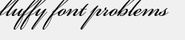

# Positionnement du texte{#text-positioning}

Le rendu text= positionne le texte fondamentalement différent du rendu textPs= lorsqu’il est appliqué aux calques prédimensionnés (c’est-à-dire lorsque size= est également spécifié).

Les calques de taille automatique `text=`et `textPs=` ont un aspect et un positionnement similaires.

`textPs=` aligne le haut de la cellule de caractère sur le haut de la zone de texte (en supposant  `\vertalt`que cela se produise, même si des parties des glyphes de texte rendus s’étendent partiellement en dehors des limites de la zone de texte. Les glyphes générés pour certaines polices peuvent également dépasser légèrement les bords gauche et droit de la zone de texte. Pour les applications exigeant que tout le texte rendu soit contenu dans le rectangle du calque, les commandes RTF `\marg*` ou `textFlowPath=` peuvent être utilisées pour ajuster la zone de rendu du texte.

En revanche, `text=` déplace le texte rendu selon les besoins et garantit que tous les glyphes rendus s’intègrent parfaitement dans la zone de texte indiquée.

Bien que `text=` soit un peu plus facile à utiliser pour les applications simples, `textPs=` offre un positionnement précis, indépendant des faces de police et des effets de texte.

## Exemples {#section-1b6bdf2ea34447528188ae4e1430ee71}

Les exemples suivants concernent le texte prédimensionné. Le comportement du texte à redimensionnement automatique est différent.

** `Text=` fournit toujours une marge étroite en haut :**

`/is/image/?size=230,50&bgc=f0f0f0&fmt=png&text=\fs40Normal%20Normal%20Normal`

** `textPs=` rend le texte étroitement aligné en haut de la zone de texte, ce qui peut entraîner un léger écrêtage, même pour les polices courantes telles que Arial:**

`/is/image/?size=230,50&bgc=f0f0f0&fmt=png&textPs=\fs40Normal%20Normal%20Normal`

** `text=` décalera automatiquement le texte rendu vers le bas pour éviter l’écrêtage :**

`/is/image?size=230,50&bgc=f0f0f0&fmt=png&text=\fs40Normal%20{\up20Raised%20}Normal`

** `textPs=` ne déplace pas le texte contenant des portions élevées, ce qui entraîne un écrêtage significatif si le texte se trouve sur le calque 0:**

`/is/image?size=230,50&bgc=f0f0f0&fmt=png&textPs=\fs40Normal%20{\up20Raised%20}Normal`

**Une marge de 10 pt (200 twips) en haut rend ce texte sans écrêtage :**

`/is/image?size=230,50&bgc=f0f0f0&fmt=png&textPs=\margt200\fs40Normal%20{\up20Raised}%20Normal`

**Les glyphes générés pour certaines polices de script peuvent s’étendre de manière significative en dehors de la zone de texte :**

`/is/image?size=230,50&bgc=f0f0f0&fmt=png&textPs={\fonttbl{\f1\fcharset0%20FluffyFont;}}\f1\fs88%20fluffy%20font%20problems`
