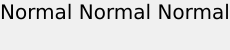
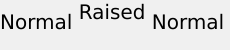
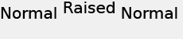
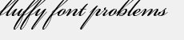

# Positionnement du texte{#text-positioning}

Le rendu `text=` positionne le texte de manière fondamentalement différente du rendu textPs= lorsqu’il est appliqué à des calques pré-dimensionnés (c’est-à-dire lorsque size= est également spécifié).

Les calques auto-dimensionnés `text=`et `textPs=` ont un aspect et un positionnement similaires.

Le `textPs=` aligne le haut de la cellule de caractère sur le haut de la zone de texte (en supposant `\vertalt`), même si certaines parties des glyphes de texte rendus s’étendent partiellement en dehors de la limite de la zone de texte. Les glyphes rendus de certaines polices peuvent également dépasser légèrement des bords gauche et droit de la zone de texte. Pour les applications nécessitant que tout le texte rendu soit contenu dans le rectangle de calque, les commandes ou `textFlowPath=` de `\marg*` RTF peuvent être utilisées pour ajuster la zone de rendu du texte.

En revanche, `text=` déplace le texte rendu selon les besoins et garantit que tous les glyphes rendus s’intègrent complètement dans la zone de texte spécifiée.

Bien qu&#39;`text=` soit un peu plus facile à utiliser pour des applications simples, `textPs=` offre un positionnement précis indépendant des faces de police et des effets de texte.

## Exemples {#section-1b6bdf2ea34447528188ae4e1430ee71}

Les exemples suivants concernent le texte pré-dimensionné. Le comportement du texte à redimensionnement automatique est différent.

**&#x200B; `Text=` fournit toujours une marge étroite en haut :**

`/is/image/?size=230,50&bgc=f0f0f0&fmt=png&text=\fs40Normal%20Normal%20Normal`

**&#x200B; `textPs=` effectue le rendu du texte étroitement aligné sur le haut de la zone de texte, ce qui entraîne un léger écrêtage, même pour les polices courantes telles qu’Arial®:**

`/is/image/?size=230,50&bgc=f0f0f0&fmt=png&textPs=\fs40Normal%20Normal%20Normal`

**&#x200B; `text=` déplace automatiquement le texte rendu vers le bas pour éviter l’écrêtage :**

`/is/image?size=230,50&bgc=f0f0f0&fmt=png&text=\fs40Normal%20{\up20Raised%20}Normal`

**&#x200B; `textPs=` ne déplace pas le texte contenant des parties surélevées, ce qui entraîne un écrêtage significatif si le texte se trouve sur le calque 0:**

`/is/image?size=230,50&bgc=f0f0f0&fmt=png&textPs=\fs40Normal%20{\up20Raised%20}Normal`

**Une marge de 10 pt (200 twips) en haut effectue le rendu de ce texte sans écrêtage :**

`/is/image?size=230,50&bgc=f0f0f0&fmt=png&textPs=\margt200\fs40Normal%20{\up20Raised}%20Normal`

**Les glyphes rendus de certaines polices de script peuvent s’étendre de manière significative en dehors de la zone de texte :**

`/is/image?size=230,50&bgc=f0f0f0&fmt=png&textPs={\fonttbl{\f1\fcharset0%20FluffyFont;}}\f1\fs88%20fluffy%20font%20problems`
