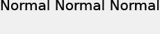

# Position du texte{#text-positioning}

Le rendu `text=` positionne le texte fondamentalement différent du rendu textPs= lorsqu’il est appliqué aux calques prédimensionnés (c’est-à-dire, lorsque size= est également spécifié).

Les calques `text=` et `textPs=` de taille autonome ont une apparence et un positionnement similaires.

L’élément `textPs=` aligne le haut de la cellule de caractère sur le haut de la zone de texte (en supposant `\vertalt`), même si des parties des glyphes de texte rendu s’étendent partiellement en dehors de la limite de la zone de texte. Les glyphes rendus de certaines polices peuvent également se propager légèrement au-delà des bords gauche et droit de la zone de texte. Pour les applications exigeant que tout le texte rendu soit contenu dans le rectangle du calque, les commandes RTF `\marg*` ou `textFlowPath=` peuvent être utilisées pour ajuster la zone de rendu du texte.

En revanche, `text=` déplace le texte rendu selon les besoins et garantit que tous les glyphes rendus correspondent entièrement à la zone de texte spécifiée.

Bien que `text=` puisse être un peu plus facile à utiliser pour des applications simples, `textPs=` offre un positionnement précis, indépendant des faces de police et des effets de texte.

## Exemples {#section-1b6bdf2ea34447528188ae4e1430ee71}

Les exemples suivants concernent du texte prédimensionné. Le comportement du texte auto-dimensionné est différent.

** `Text=` fournit toujours une marge étroite en haut :**

`/is/image/?size=230,50&bgc=f0f0f0&fmt=png&text=\fs40Normal%20Normal%20Normal`

** `textPs=` effectue le rendu du texte étroitement aligné en haut de la zone de texte, ce qui entraîne un léger écrêtage, même pour les polices courantes telles que Arial®:**

`/is/image/?size=230,50&bgc=f0f0f0&fmt=png&textPs=\fs40Normal%20Normal%20Normal`

** `text=` déplace automatiquement le texte rendu vers le bas pour éviter l’écrêtage :**

`/is/image?size=230,50&bgc=f0f0f0&fmt=png&text=\fs40Normal%20{\up20Raised%20}Normal`

** `textPs=` ne déplace pas le texte contenant des portions élevées, ce qui entraîne un détourage significatif si le texte se trouve sur le calque 0 :**

`/is/image?size=230,50&bgc=f0f0f0&fmt=png&textPs=\fs40Normal%20{\up20Raised%20}Normal`

**Une marge de 10 pt (200 twips) dans la partie supérieure rend ce texte sans détourage :**

`/is/image?size=230,50&bgc=f0f0f0&fmt=png&textPs=\margt200\fs40Normal%20{\up20Raised}%20Normal`

**Les glyphes rendus de certaines polices de script peuvent s’étendre de manière significative en dehors de la zone de texte :**

`/is/image?size=230,50&bgc=f0f0f0&fmt=png&textPs={\fonttbl{\f1\fcharset0%20FluffyFont;}}\f1\fs88%20fluffy%20font%20problems`
