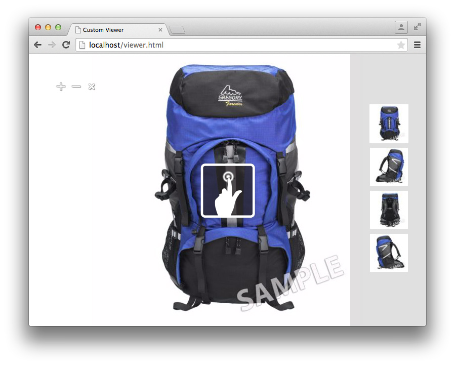

# Didacticiel sur le kit SDK de la visionneuse{#viewer-sdk-tutorial}

Le Kit de développement logiciel (SDK) de visionneuse fournit un ensemble de composants basés sur JavaScript pour le développement d’une visionneuse personnalisée. Les visionneuses sont des applications Web qui permettent d’intégrer du contenu multimédia enrichi diffusé par Adobe Dynamic Media dans des pages Web.

Le SDK propose par exemple un zoom et un panoramique interactifs. Il fournit également une vue à 360° et une lecture vidéo des ressources téléchargées sur Adobe Dynamic Media via l’application backend appelée Dynamic Media Classic.

Même si les composants reposent sur la fonctionnalité HTML5, ils sont conçus pour fonctionner sur les appareils Android™ et Apple iOS, ainsi que sur les ordinateurs de bureau, y compris Internet Explorer et versions ultérieures. Ce type d’expérience signifie que vous êtes en mesure de fournir un flux de travail unique pour toutes les plates-formes prises en charge.

Le SDK se compose de composants de l’interface utilisateur qui composent le contenu de la visionneuse. Vous pouvez mettre en forme ces composants via CSS et les composants hors interface utilisateur qui ont une sorte de rôle de soutien, comme la récupération et l’analyse ou le suivi des définitions. Tous les comportements des composants sont personnalisables via des modificateurs que vous pouvez spécifier de différentes manières, par exemple, sous forme `name=value` de paires dans l’URL.

Ce didacticiel comprend l’ordre de tâches suivant pour vous aider à créer une visionneuse de zoom de base :

* [Téléchargez le kit de développement de visionneuse le plus récent à partir d’Adobe Developer Connection](c-tutorial.md#section-84dc74c9d8e24a2380b6cf8fc28d7127)
* [Chargement du kit SDK de visionneuse](c-tutorial.md#section-98596c276faf4cf79ccf558a9f4432c6)
* [Ajout de style à votre visionneuse](c-tutorial.md#section-3783125360a1425eae5a5a334867cc32)
* [Conteneur et ZoomView inclus](c-tutorial.md#section-1a01730663154a508b88cc40c6f35539)
* [Ajout des composants MediaSet et Swatch à votre visionneuse](c-tutorial.md#section-02b8c21dd842400e83eae2a48ec265b7)
* [Ajout de boutons à votre visionneuse](c-tutorial.md#section-1fc334fa0d2b47eb9cdad461725c07be)
* [Configuration verticale des échantillons](c-tutorial.md#section-91a8829d5b5a4d45a35b7faeb097fcc9)

## Téléchargez le kit de développement de visionneuse le plus récent à partir d’Adobe Developer Connection {#section-84dc74c9d8e24a2380b6cf8fc28d7127}

1. Téléchargez la dernière version du kit de développement logiciel Viewer SDK à partir de Adobe Developer Connection <!-- SDK NO LONGER AVAILABLE TO DOWNLOAD;DOUBLE CHECK WITH AMIT. THIS ENTIRE TOPIC IS LIKELY OBSOLETE. [here](https://marketing.adobe.com/developer/devcenter/scene7/show) -->.

   >[!NOTE]
   >
   >Vous pouvez suivre ce didacticiel sans avoir besoin de télécharger le package SDK de la visionneuse, car le Kit de développement logiciel (SDK) est chargé à distance. Toutefois, le package Viewer inclut des exemples supplémentaires et un guide de référence API qui peut vous aider à créer vos propres visionneuses.

## Chargement du kit SDK de visionneuse {#section-98596c276faf4cf79ccf558a9f4432c6}

1. Commencez par configurer une nouvelle page pour développer la visionneuse de zoom de base que vous allez créer.

   Considérez cette nouvelle page comme le code Bootstrap (ou chargeur) que vous utilisez pour configurer une application SDK vide. Ouvrez votre éditeur de texte préféré et collez-y les balises HTML suivantes :

   ```html {.line-numbers}
   <!DOCTYPE html> 
   <html> 
       <head> 
           <meta http-equiv="Content-Type" content="text/html; charset=utf-8" /> 
           <meta name="viewport" content="user-scalable=no, height=device-height, width=device-width, initial-scale=1.0, maximum-scale=1.0"/> 
   
           <!-- Hiding the Safari on iPhone OS UI components --> 
           <meta name="apple-mobile-web-app-capable" content="yes"/> 
           <meta name="apple-mobile-web-app-status-bar-style" content="black"/> 
           <meta name="apple-touch-fullscreen" content="no"/> 
   
           <title>Custom Viewer</title> 
   
           <!-- 
               Include Utils.js before you use any of the SDK components. This file  
               contains SDK utilities and global functions that are used to initialize the viewer and load viewer  
               components. The path to the Utils.js determines which version of the SDK that the viewer uses. You  
               can use a relative path if the viewer is deployed on one of the Adobe Dynamic Media servers and it is served  
               from the same domain. Otherwise, specify a full path to one of Adobe Dynamic Media servers that have the SDK  
               installed.  
           --> 
           <script language="javascript" type="text/javascript"      
                   src="http://s7d1.scene7.com/s7sdk/2.8/js/s7sdk/utils/Utils.js"></script> 
   
       </head> 
       <body> 
           <script language="javascript" type="text/javascript"> 
           </script>  
       </body> 
   </html>
   ```

   Ajoutez le code JavaScript suivant à l’intérieur de la `script` balise afin qu’elle initialise le `ParameterManager`fichier . Cela vous aide à préparer la création et l’instanciation des composants SDK à l’intérieur de la `initViewer` fonction :

   ```javascript {.line-numbers}
   /* We create a self-running anonymous function to encapsulate variable scope. Placing code inside such 
      a function is optional, but this prevents variables from polluting the global object.  */ 
   (function () { 
   
       // Initialize the SDK   
       s7sdk.Util.init(); 
   
       /* Create an instance of the ParameterManager component to collect components' configuration 
          that can come from a viewer preset, URL, or the HTML page itself. The ParameterManager  
          component also sends a notification s7sdk.Event.SDK_READY when all needed files are loaded 
          and the configuration parameters are processed. The other components should never be initialized 
          outside this handler. After defining the handler for the s7sdk.Event.SDK_READY event, it 
          is safe to initiate configuration initialization by calling ParameterManager.init(). */ 
       var params = new s7sdk.ParameterManager(); 
   
       /* Event handler for s7sdk.Event.SDK_READY dispatched by ParameterManager to initialize various components of  
          this viewer. */ 
       function initViewer() { 
   
       }  
   
       /* Add event handler for the s7sdk.Event.SDK_READY event dispatched by the ParameterManager when all modifiers 
          are processed and it is safe to initialize the viewer. */ 
       params.addEventListener(s7sdk.Event.SDK_READY, initViewer, false); 
   
       /* Initiate configuration initialization of ParameterManager. */ 
       params.init(); 
   
   }());
   ```

1. Enregistrez le fichier en tant que modèle vide. Vous pouvez utiliser n’importe quel nom de fichier.

   Vous pouvez utiliser ce fichier de modèle vide comme référence lorsque vous créez des visionneuses à l’avenir. Ce modèle fonctionne localement et lorsqu’il est diffusé à partir d’un serveur Web.

Ajoutez maintenant du style à votre visionneuse.

## Ajout de style à votre visionneuse {#section-3783125360a1425eae5a5a334867cc32}

1. Pour cette visionneuse pleine page que vous créez, vous pouvez ajouter quelques styles de base.

   Ajoutez le bloc suivant `style` au bas du `head`fichier :

   ```html {.line-numbers}
   <style> 
       html, body { 
           width: 100%; 
           height: 100%; 
       } 
       body { 
           /* Remove any padding and margin around the edges of the browser window */ 
           padding: 0; 
           margin: 0; 
   
           /* We set overflow to hidden so that scroll bars do not flicker when resizing the window */ 
           overflow: hidden; 
       } 
   </style>
   ```

Incluez maintenant les composants `Container` et `ZoomView`.

## Conteneur et ZoomView inclus {#section-1a01730663154a508b88cc40c6f35539}

1. Créez une visionneuse réelle en incluant les composants `Container` et `ZoomView`.

   Insérez les instructions suivantes `include` au bas de l’élément `<head>` , après le chargement du [!DNL Utils.js] script :

   ```javascript {.line-numbers}
   <!-- 
       Add an "include" statement with a related module for each component that is needed for that particular  
       viewer. Check API documentation to see a complete list of components and their modules. 
   --> 
   <script language="javascript" type="text/javascript"> 
       s7sdk.Util.lib.include('s7sdk.common.Container');  
       s7sdk.Util.lib.include('s7sdk.image.ZoomView');  
   </script>
   ```

1. Créez maintenant des variables pour référencer les différents composants du SDK.

   Ajoutez les variables suivantes en haut de la fonction anonyme principale, juste au-dessus `s7sdk.Util.init()`:

   ```javascript {.line-numbers}
   var container, zoomView;
   ```

1. Insérez ce qui suit dans la `initViewer` fonction afin de pouvoir définir des modificateurs et instancier les composants respectifs :

   ```javascript {.line-numbers}
   /* Modifiers can be added directly to ParameterManager instance */ 
   params.push("serverurl", "http://s7d1.scene7.com/is/image"); 
   params.push("asset", "Scene7SharedAssets/ImageSet-Views-Sample"); 
   
   /* Create a viewer container as a parent component for other user interface components that  
      are part of the viewer application and associate event handlers for resize and  
      full-screen notification. The advantage of using Container as the parent is the  
      component's ability to resize and bring itself and its children to full-screen. */ 
   container = new s7sdk.common.Container(null, params, "s7container"); 
   container.addEventListener(s7sdk.event.ResizeEvent.COMPONENT_RESIZE, containerResize, false); 
   
   /* Create ZoomView component */ 
   zoomView = new s7sdk.image.ZoomView("s7container", params, "myZoomView");  
   
   /* We call this to ensure all SDK components are scaled to initial conditions when viewer loads */ 
   resizeViewer(container.getWidth(), container.getHeight());
   ```

1. Pour que le code ci-dessus s’exécute correctement, ajoutez un gestionnaire d’événements `containerResize` et une fonction d’assistance :

   ```javascript {.line-numbers}
   /* Event handler for s7sdk.event.ResizeEvent.COMPONENT_RESIZE events dispatched by Container to resize 
      various view components included in this viewer. */ 
   function containerResize(event) { 
       resizeViewer(event.s7event.w, event.s7event.h); 
   } 
   
   /* Resize viewer components */ 
   function resizeViewer(width, height) { 
       zoomView.resize(width, height); 
   }
   ```

1. Affichez un aperçu de la page pour voir ce que vous avez créé. Votre page doit ressembler à ce qui suit :

   

Ajoutez maintenant les composants `MediaSet` et `Swatches` à votre visionneuse.

## Ajout des composants MediaSet et Swatch à votre visionneuse {#section-02b8c21dd842400e83eae2a48ec265b7}

1. Pour permettre aux utilisateurs de sélectionner des images d’une visionneuse, vous pouvez ajouter les composants `MediaSet` et `Swatches`.

   Ajout des SDK suivants :

   ```javascript {.line-numbers}
   s7sdk.Util.lib.include('s7sdk.set.MediaSet'); 
   s7sdk.Util.lib.include('s7sdk.set.Swatches');
   ```

1. Mettez à jour la liste de variables avec les éléments suivants :

   ```javascript {.line-numbers}
   var mediaSet, container, zoomView, swatches;
   ```

1. Instancier `MediaSet` et `Swatches` composants à l’intérieur de la `initViewer` fonction.

   Veillez à instancier l’instance `Swatches` après les `ZoomView` composants et`Container`, sinon l’ordre d’empilement masque :`Swatches`

   ```javascript {.line-numbers}
   // Create MediaSet to manage assets and add event listener to the NOTF_SET_PARSED event 
   mediaSet = new s7sdk.set.MediaSet(null, params, "mediaSet"); 
   
   // Add MediaSet event listener 
   mediaSet.addEventListener(s7sdk.event.AssetEvent.NOTF_SET_PARSED, onSetParsed, false); 
   
   /* create Swatches component and associate event handler for swatch selection notification */ 
   swatches = new s7sdk.set.Swatches("s7container", params, "mySwatches");   
   swatches.addEventListener(s7sdk.event.AssetEvent.SWATCH_SELECTED_EVENT, swatchSelected, false);
   ```

1. Ajoutez maintenant les fonctions de gestionnaire d’événements suivantes :

   ```javascript {.line-numbers}
   /* Event handler for the s7sdk.event.AssetEvent.NOTF_SET_PARSED event dispatched by MediaSet to 
      assign the asset to the Swatches when parsing is complete. */ 
   function onSetParsed(e) { 
   
       // set media set for Swatches to display  
       var mediasetDesc = e.s7event.asset;  
       swatches.setMediaSet(mediasetDesc); 
   
       // select the first swatch by default  
       swatches.selectSwatch(0, true);      
   } 
   
   /* Event handler for s7sdk.event.AssetEvent.SWATCH_SELECTED_EVENT events dispatched by Swatches to switch 
      the image in the ZoomView when a different swatch is selected. */ 
   function swatchSelected(event) {     
       zoomView.setItem(event.s7event.asset);  
   }
   ```

1. Placez les nuances au bas de la visionneuse en ajoutant le code CSS suivant à l’élément `style` :

   ```CSS {.line-numbers}
   /* Align swatches to bottom of viewer */ 
   .s7swatches { 
       bottom: 0; 
       left: 0; 
       right: 0; 
       height: 150px; 
   }
   ```

1. Prévisualisez votre visionneuse.

   Notez que les échantillons se trouvent dans le coin inférieur gauche de la visionneuse. Pour que les échantillons prennent toute la largeur de la visionneuse, ajoutez un appel pour redimensionner manuellement les échantillons chaque fois que l’utilisateur redimensionne son navigateur. Ajoutez le code suivant à la `resizeViewer` fonction :

   ```javascript {.line-numbers}
   swatches.resize(width, swatches.getHeight());
   ```

   Votre visionneuse ressemble maintenant à l’image suivante. Essayez de redimensionner la fenêtre du navigateur de la visionneuse et observez le comportement qui en résulte.

   

Ajoutez maintenant des boutons de zoom avant, de zoom arrière et de réinitialisation du zoom à votre visionneuse.

## Ajout de boutons à votre visionneuse {#section-1fc334fa0d2b47eb9cdad461725c07be}

1. Actuellement, l’utilisateur ne peut zoomer qu’en utilisant des gestes de clic ou de toucher. Par conséquent, ajoutez quelques boutons de contrôle de zoom de base à la visionneuse.

   Ajoutez les composants de bouton suivants :

   ```CSS {.line-numbers}
   s7sdk.Util.lib.include('s7sdk.common.Button');
   ```

1. Mettez à jour la liste de variables avec les éléments suivants :

   ```javascript {.line-numbers}
   var mediaSet, container, zoomView, swatches, zoomInButton, zoomOutButton, zoomResetButton;
   ```

1. Instancier des boutons au bas de `initViewer` la fonction.

   N’oubliez pas que l’ordre est important, sauf si vous spécifiez dans CSS `z-index` :

   ```CSS {.line-numbers}
   /* Create Zoom In, Zoom Out and Zoom Reset buttons */ 
   zoomInButton  = new s7sdk.common.ZoomInButton("s7container", params, "zoomInBtn"); 
   zoomOutButton = new s7sdk.common.ZoomOutButton("s7container", params, "zoomOutBtn"); 
   zoomResetButton = new s7sdk.common.ZoomResetButton("s7container", params, "zoomResetBtn"); 
   
   /* Add handlers for zoom in, zoom out and zoom reset buttons inline. */ 
   zoomInButton.addEventListener("click", function() { zoomView.zoomIn(); }); 
   zoomOutButton.addEventListener("click", function() { zoomView.zoomOut(); }); 
   zoomResetButton.addEventListener("click", function() { zoomView.zoomReset(); });
   ```

1. Définissez maintenant quelques styles de base pour les boutons en ajoutant ce qui suit au `style` bloc en haut de votre fichier :

   ```CSS {.line-numbers}
   /* define styles common to all button components and their sub-classes */ 
   .s7button { 
       position:absolute; 
       width: 28px; 
       height: 28px; 
       z-index:100; 
   } 
   
   /* position individual buttons*/ 
   .s7zoominbutton  { 
       top: 50px; 
       left: 50px; 
    } 
   .s7zoomoutbutton  { 
       top: 50px; 
       left: 80px; 
    } 
   .s7zoomresetbutton  { 
       top: 50px; 
       left: 110px; 
    }
   ```

1. Prévisualisez votre visionneuse. Il doit ressembler à ce qui suit :

   

   Maintenant, configurez les échantillons afin qu’ils soient alignés verticalement sur la droite.

## Configuration verticale des échantillons {#section-91a8829d5b5a4d45a35b7faeb097fcc9}

1. Vous pouvez configurer les modificateurs directement sur l’instance `ParameterManager` .

   Ajoutez ce qui suit en haut de la `initViewer` fonction afin de pouvoir configurer la disposition miniature `Swatches` comme une seule ligne :

   ```javascript {.line-numbers}
   params.push("Swatches.tmblayout", "1,0");
   ```

1. Mettez à jour l’appel de redimensionnement suivant à l’intérieur `resizeViewer`:

   ```javascript {.line-numbers}
   swatches.resize(swatches.getWidth(), height);
   ```

1. Modifiez la règle suivante `s7swatches` dans `ZoomViewer.css`:

   ```CSS {.line-numbers}
   .s7swatches { 
       top:0 ; 
       bottom: 0; 
       right: 0; 
       width: 150px; 
   }
   ```

1. Prévisualisez votre visionneuse. Il ressemble à ce qui suit :

   

   Votre visionneuse de zoom de base est maintenant terminée.

   Ce tutoriel de visionneuse aborde les principes fondamentaux de ce que fournit le SDK de la visionneuse Dynamic Media. Lorsque vous travaillez avec le SDK, vous pouvez utiliser les différents composants standard pour créer et styliser facilement des expériences de visionnage riches pour vos publics cibles.
