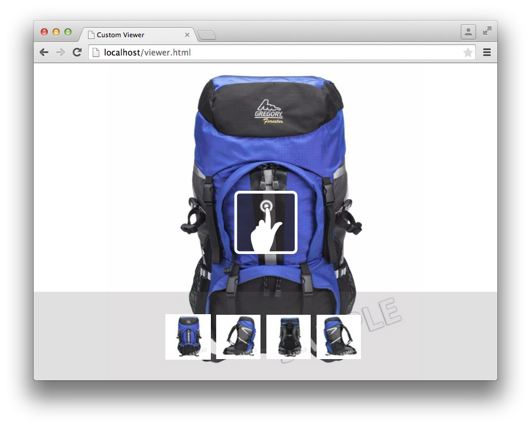
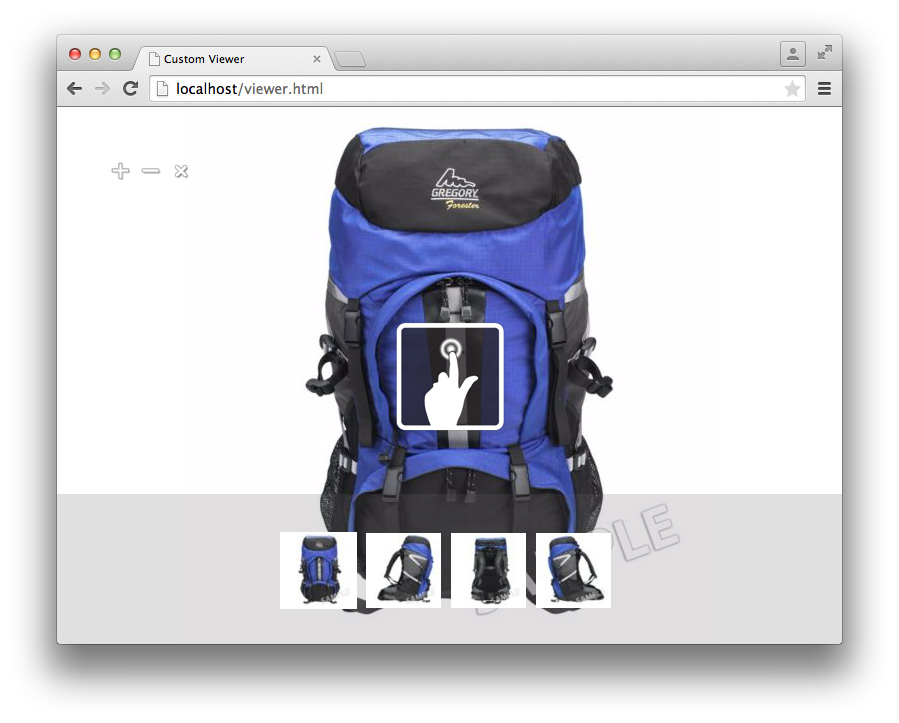

# Tutoriel sur la visionneuse SDK{#viewer-sdk-tutorial}

Le SDK de la visionneuse fournit un ensemble de composants basés sur JavaScript pour le développement de visionneuses personnalisées. Les visionneuses sont des applications web qui permettent d’incorporer du contenu multimédia enrichi diffusé par Adobe Dynamic Media dans des pages web.

Par exemple, le SDK offre un zoom et un panoramique interactifs. Elle fournit également une lecture vidéo et une vue à 360° des ressources qui ont été chargées vers Adobe Dynamic Media par le biais de l’application principale appelée Dynamic Media Classic.

Même si les composants dépendent des fonctionnalités d’HTML5, ils sont conçus pour fonctionner sur les appareils et ordinateurs de bureau Android™ et Apple iOS, y compris Internet Explorer et versions ultérieures. Ce type d’expérience signifie que vous êtes en mesure de fournir un seul workflow pour toutes les plateformes prises en charge.

Le SDK se compose de composants d’interface utilisateur qui constituent le contenu de la visionneuse. Vous pouvez mettre en forme ces composants par le biais de composants CSS et non UI qui ont un rôle de support, comme la récupération et l’analyse de définitions de jeux ou le suivi. Tous les comportements de composant sont personnalisables par le biais de modificateurs que vous pouvez spécifier de différentes manières, par exemple sous la forme de paires de `name=value` dans l’URL.

Ce tutoriel comprend l’ordre suivant de tâches pour vous aider à créer une visionneuse zoom de base :

* [Téléchargez la dernière version du SDK de visionneuse à partir de Adobe Developer Connection](c-tutorial.md#section-84dc74c9d8e24a2380b6cf8fc28d7127)
* [Chargement du SDK de la visionneuse](c-tutorial.md#section-98596c276faf4cf79ccf558a9f4432c6)
* [Ajout de style à la visionneuse](c-tutorial.md#section-3783125360a1425eae5a5a334867cc32)
* [Inclusion de Container et ZoomView](c-tutorial.md#section-1a01730663154a508b88cc40c6f35539)
* [Ajout des composants MediaSet et Swatches à la visionneuse](c-tutorial.md#section-02b8c21dd842400e83eae2a48ec265b7)
* [Ajout de boutons à la visionneuse](c-tutorial.md#section-1fc334fa0d2b47eb9cdad461725c07be)
* [Configuration verticale des nuanciers](c-tutorial.md#section-91a8829d5b5a4d45a35b7faeb097fcc9)

## Télécharger la dernière version du SDK de visionneuse à partir de Adobe Developer Connection {#section-84dc74c9d8e24a2380b6cf8fc28d7127}

1. Téléchargez le dernier SDK de visionneuse à partir de Adobe Developer Connection <!-- SDK NO LONGER AVAILABLE TO DOWNLOAD;DOUBLE CHECK WITH AMIT. THIS ENTIRE TOPIC IS LIKELY OBSOLETE. [here](https://marketing.adobe.com/developer/devcenter/scene7/show) -->.

   >[!NOTE]
   >
   >Vous pouvez suivre ce tutoriel sans avoir à télécharger le package Visionneuse SDK, car le SDK est chargé à distance. Cependant, le package Visionneuse comprend des exemples supplémentaires et un guide de référence de l’API qui peut vous aider à créer vos propres visionneuses.

## Chargement du SDK de la visionneuse {#section-98596c276faf4cf79ccf558a9f4432c6}

1. Commencez par configurer une nouvelle page pour développer la visionneuse de zoom de base que vous allez créer.

   Considérez cette nouvelle page comme le code Bootstrap (ou chargeur) que vous utilisez pour configurer une application SDK vide. Ouvrez votre éditeur de texte préféré et collez-y les balises HTML suivantes :

   ```html {.line-numbers}
   <!DOCTYPE html> 
   <html> 
       <head> 
           <meta http-equiv="Content-Type" content="text/html; charset=utf-8" /> 
           <meta name="viewport" content="user-scalable=no, height=device-height, width=device-width, initial-scale=1.0, maximum-scale=1.0"/> 
   
           <!-- Hiding the Safari on iPhone OS UI components --> 
           <meta name="apple-mobile-web-app-capable" content="yes"/> 
           <meta name="apple-mobile-web-app-status-bar-style" content="black"/> 
           <meta name="apple-touch-fullscreen" content="no"/> 
   
           <title>Custom Viewer</title> 
   
           <!-- 
               Include Utils.js before you use any of the SDK components. This file  
               contains SDK utilities and global functions that are used to initialize the viewer and load viewer  
               components. The path to the Utils.js determines which version of the SDK that the viewer uses. You  
               can use a relative path if the viewer is deployed on one of the Adobe Dynamic Media servers and it is served  
               from the same domain. Otherwise, specify a full path to one of Adobe Dynamic Media servers that have the SDK  
               installed.  
           --> 
           <script language="javascript" type="text/javascript"      
                   src="http://s7d1.scene7.com/s7sdk/2.8/js/s7sdk/utils/Utils.js"></script> 
   
       </head> 
       <body> 
           <script language="javascript" type="text/javascript"> 
           </script>  
       </body> 
   </html>
   ```

   Ajoutez le code JavaScript suivant dans la balise `script` afin qu’elle initialise le `ParameterManager`. Cela vous permet de préparer la création et l’instanciation des composants SDK dans la fonction `initViewer` :

   ```javascript {.line-numbers}
   /* We create a self-running anonymous function to encapsulate variable scope. Placing code inside such 
      a function is optional, but this prevents variables from polluting the global object.  */ 
   (function () { 
   
       // Initialize the SDK   
       s7sdk.Util.init(); 
   
       /* Create an instance of the ParameterManager component to collect components' configuration 
          that can come from a viewer preset, URL, or the HTML page itself. The ParameterManager  
          component also sends a notification s7sdk.Event.SDK_READY when all needed files are loaded 
          and the configuration parameters are processed. The other components should never be initialized 
          outside this handler. After defining the handler for the s7sdk.Event.SDK_READY event, it 
          is safe to initiate configuration initialization by calling ParameterManager.init(). */ 
       var params = new s7sdk.ParameterManager(); 
   
       /* Event handler for s7sdk.Event.SDK_READY dispatched by ParameterManager to initialize various components of  
          this viewer. */ 
       function initViewer() { 
   
       }  
   
       /* Add event handler for the s7sdk.Event.SDK_READY event dispatched by the ParameterManager when all modifiers 
          are processed and it is safe to initialize the viewer. */ 
       params.addEventListener(s7sdk.Event.SDK_READY, initViewer, false); 
   
       /* Initiate configuration initialization of ParameterManager. */ 
       params.init(); 
   
   }());
   ```

1. Enregistrez le fichier en tant que modèle vide. Vous pouvez utiliser le nom de fichier de votre choix.

   Vous pouvez utiliser ce fichier de modèle vide comme référence lors de la création ultérieure d’une visionneuse. Ce modèle fonctionne localement et lorsqu’il est diffusé à partir d’un serveur web.

Ajoutez maintenant du style à votre visionneuse.

## Ajout de style à la visionneuse {#section-3783125360a1425eae5a5a334867cc32}

1. Pour la visionneuse de pages complète que vous êtes en train de créer, vous pouvez ajouter quelques styles de base.

   Ajoutez le bloc de `style` suivant au bas de la `head` :

   ```html {.line-numbers}
   <style> 
       html, body { 
           width: 100%; 
           height: 100%; 
       } 
       body { 
           /* Remove any padding and margin around the edges of the browser window */ 
           padding: 0; 
           margin: 0; 
   
           /* We set overflow to hidden so that scroll bars do not flicker when resizing the window */ 
           overflow: hidden; 
       } 
   </style>
   ```

Incluez maintenant les composants `Container` et `ZoomView`.

## Inclusion de Container et ZoomView {#section-1a01730663154a508b88cc40c6f35539}

1. Créez une visionneuse en incluant les composants `Container` et `ZoomView`.

   Insérez les instructions `include` suivantes au bas de l’élément `<head>`, après le chargement du script [!DNL Utils.js] :

   ```javascript {.line-numbers}
   <!-- 
       Add an "include" statement with a related module for each component that is needed for that particular  
       viewer. Check API documentation to see a complete list of components and their modules. 
   --> 
   <script language="javascript" type="text/javascript"> 
       s7sdk.Util.lib.include('s7sdk.common.Container');  
       s7sdk.Util.lib.include('s7sdk.image.ZoomView');  
   </script>
   ```

1. Créez maintenant des variables pour référencer les différents composants SDK.

   Ajoutez les variables suivantes en haut de la fonction anonyme principale, juste au-dessus de `s7sdk.Util.init()` :

   ```javascript {.line-numbers}
   var container, zoomView;
   ```

1. Insérez les éléments suivants dans la fonction `initViewer` afin de pouvoir définir certains modificateurs et instancier les composants respectifs :

   ```javascript {.line-numbers}
   /* Modifiers can be added directly to ParameterManager instance */ 
   params.push("serverurl", "http://s7d1.scene7.com/is/image"); 
   params.push("asset", "Scene7SharedAssets/ImageSet-Views-Sample"); 
   
   /* Create a viewer container as a parent component for other user interface components that  
      are part of the viewer application and associate event handlers for resize and  
      full-screen notification. The advantage of using Container as the parent is the  
      component's ability to resize and bring itself and its children to full-screen. */ 
   container = new s7sdk.common.Container(null, params, "s7container"); 
   container.addEventListener(s7sdk.event.ResizeEvent.COMPONENT_RESIZE, containerResize, false); 
   
   /* Create ZoomView component */ 
   zoomView = new s7sdk.image.ZoomView("s7container", params, "myZoomView");  
   
   /* We call this to ensure all SDK components are scaled to initial conditions when viewer loads */ 
   resizeViewer(container.getWidth(), container.getHeight());
   ```

1. Pour que le code ci-dessus s’exécute correctement, ajoutez un gestionnaire d’événements `containerResize` et une fonction d’assistance :

   ```javascript {.line-numbers}
   /* Event handler for s7sdk.event.ResizeEvent.COMPONENT_RESIZE events dispatched by Container to resize 
      various view components included in this viewer. */ 
   function containerResize(event) { 
       resizeViewer(event.s7event.w, event.s7event.h); 
   } 
   
   /* Resize viewer components */ 
   function resizeViewer(width, height) { 
       zoomView.resize(width, height); 
   }
   ```

1. Prévisualisez la page pour voir ce que vous avez créé. Votre page doit se présenter comme suit :

   

Ajoutez maintenant les composants `MediaSet` et `Swatches` à votre visionneuse.

## Ajout de composants MediaSet et Swatches à votre visionneuse {#section-02b8c21dd842400e83eae2a48ec265b7}

1. Pour permettre aux utilisateurs de sélectionner des images à partir d’une visionneuse, vous pouvez ajouter les composants `MediaSet` et `Swatches`.

   Ajoutez les SDK suivantes :

   ```javascript {.line-numbers}
   s7sdk.Util.lib.include('s7sdk.set.MediaSet'); 
   s7sdk.Util.lib.include('s7sdk.set.Swatches');
   ```

1. Mettez à jour la liste des variables avec les éléments suivants :

   ```javascript {.line-numbers}
   var mediaSet, container, zoomView, swatches;
   ```

1. Instanciez les composants `MediaSet` et `Swatches` dans la fonction `initViewer`.

   Veillez à instancier l’instance de `Swatches` après les composants `ZoomView` et `Container`, sinon l’ordre d’empilement masque le `Swatches` :

   ```javascript {.line-numbers}
   // Create MediaSet to manage assets and add event listener to the NOTF_SET_PARSED event 
   mediaSet = new s7sdk.set.MediaSet(null, params, "mediaSet"); 
   
   // Add MediaSet event listener 
   mediaSet.addEventListener(s7sdk.event.AssetEvent.NOTF_SET_PARSED, onSetParsed, false); 
   
   /* create Swatches component and associate event handler for swatch selection notification */ 
   swatches = new s7sdk.set.Swatches("s7container", params, "mySwatches");   
   swatches.addEventListener(s7sdk.event.AssetEvent.SWATCH_SELECTED_EVENT, swatchSelected, false);
   ```

1. Ajoutez maintenant les fonctions de gestionnaire d&#39;événements suivantes :

   ```javascript {.line-numbers}
   /* Event handler for the s7sdk.event.AssetEvent.NOTF_SET_PARSED event dispatched by MediaSet to 
      assign the asset to the Swatches when parsing is complete. */ 
   function onSetParsed(e) { 
   
       // set media set for Swatches to display  
       var mediasetDesc = e.s7event.asset;  
       swatches.setMediaSet(mediasetDesc); 
   
       // select the first swatch by default  
       swatches.selectSwatch(0, true);      
   } 
   
   /* Event handler for s7sdk.event.AssetEvent.SWATCH_SELECTED_EVENT events dispatched by Swatches to switch 
      the image in the ZoomView when a different swatch is selected. */ 
   function swatchSelected(event) {     
       zoomView.setItem(event.s7event.asset);  
   }
   ```

1. Placez les échantillons au bas de la visionneuse en ajoutant le CSS suivant à l’élément `style` :

   ```CSS {.line-numbers}
   /* Align swatches to bottom of viewer */ 
   .s7swatches { 
       bottom: 0; 
       left: 0; 
       right: 0; 
       height: 150px; 
   }
   ```

1. Prévisualisez votre visionneuse.

   Notez que les échantillons se trouvent dans le coin inférieur gauche de la visionneuse. Pour que les échantillons couvrent toute la largeur de la visionneuse, ajoutez un appel pour redimensionner manuellement les échantillons chaque fois que l’utilisateur redimensionne son navigateur. Ajoutez les éléments suivants à la fonction `resizeViewer` :

   ```javascript {.line-numbers}
   swatches.resize(width, swatches.getHeight());
   ```

   Votre visionneuse ressemble désormais à l’image suivante. Essayez de redimensionner la fenêtre du navigateur de la visionneuse et notez le comportement qui en résulte.

   

Ajoutez maintenant les boutons de zoom avant, de zoom arrière et de réinitialisation du zoom à votre visionneuse.

## Ajout de boutons à votre visionneuse {#section-1fc334fa0d2b47eb9cdad461725c07be}

1. Actuellement, l’utilisateur peut uniquement effectuer un zoom à l’aide de gestes tactiles ou de clic. Par conséquent, ajoutez des boutons de contrôle de zoom de base à la visionneuse.

   Ajoutez les composants de bouton suivants :

   ```CSS {.line-numbers}
   s7sdk.Util.lib.include('s7sdk.common.Button');
   ```

1. Mettez à jour la liste des variables avec les éléments suivants :

   ```javascript {.line-numbers}
   var mediaSet, container, zoomView, swatches, zoomInButton, zoomOutButton, zoomResetButton;
   ```

1. Boutons d’instanciation au bas de `initViewer` fonction.

   N’oubliez pas que l’ordre est important, sauf si vous spécifiez le `z-index` dans CSS :

   ```CSS {.line-numbers}
   /* Create Zoom In, Zoom Out and Zoom Reset buttons */ 
   zoomInButton  = new s7sdk.common.ZoomInButton("s7container", params, "zoomInBtn"); 
   zoomOutButton = new s7sdk.common.ZoomOutButton("s7container", params, "zoomOutBtn"); 
   zoomResetButton = new s7sdk.common.ZoomResetButton("s7container", params, "zoomResetBtn"); 
   
   /* Add handlers for zoom in, zoom out and zoom reset buttons inline. */ 
   zoomInButton.addEventListener("click", function() { zoomView.zoomIn(); }); 
   zoomOutButton.addEventListener("click", function() { zoomView.zoomOut(); }); 
   zoomResetButton.addEventListener("click", function() { zoomView.zoomReset(); });
   ```

1. Définissez maintenant certains styles de base pour les boutons en ajoutant les éléments suivants au bloc `style` en haut de votre fichier :

   ```CSS {.line-numbers}
   /* define styles common to all button components and their sub-classes */ 
   .s7button { 
       position:absolute; 
       width: 28px; 
       height: 28px; 
       z-index:100; 
   } 
   
   /* position individual buttons*/ 
   .s7zoominbutton  { 
       top: 50px; 
       left: 50px; 
    } 
   .s7zoomoutbutton  { 
       top: 50px; 
       left: 80px; 
    } 
   .s7zoomresetbutton  { 
       top: 50px; 
       left: 110px; 
    }
   ```

1. Prévisualisez votre visionneuse. Elle doit se présenter comme suit :

   

   Configurez maintenant les nuanciers de sorte qu’ils soient alignés verticalement sur la droite.

## Configuration verticale des nuanciers {#section-91a8829d5b5a4d45a35b7faeb097fcc9}

1. Vous pouvez configurer des modificateurs directement sur l’instance `ParameterManager`.

   Ajoutez ce qui suit en haut de la fonction `initViewer` pour pouvoir configurer la disposition des pouces `Swatches` comme une seule ligne :

   ```javascript {.line-numbers}
   params.push("Swatches.tmblayout", "1,0");
   ```

1. Mettez à jour l’appel de redimensionnement suivant dans `resizeViewer` :

   ```javascript {.line-numbers}
   swatches.resize(swatches.getWidth(), height);
   ```

1. Modifiez la règle de `s7swatches` suivante dans `ZoomViewer.css` :

   ```CSS {.line-numbers}
   .s7swatches { 
       top:0 ; 
       bottom: 0; 
       right: 0; 
       width: 150px; 
   }
   ```

1. Prévisualisez votre visionneuse. Il ressemble à ce qui suit :

   

   La visionneuse de zoom de base est maintenant terminée.

   Ce tutoriel sur la visionneuse aborde les principes de base de la fonction SDK de la visionneuse Dynamic Media. Lorsque vous utilisez SDK, vous pouvez utiliser les différents composants standard pour créer et mettre en forme facilement des expériences de visionnage enrichies pour vos audiences cibles.
